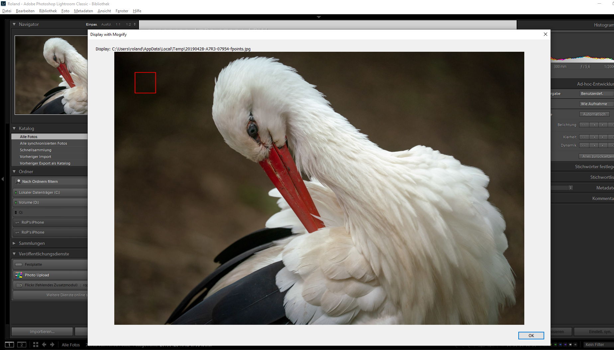
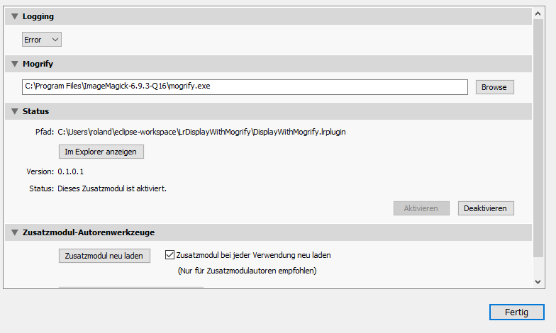

# LrDisplayWithMogrify

Display an image from the lightroom catalog with a mogrify frame on Windows platform. This is a POC for the adaption of the "Focus-Points" project to Windows platforms.

The border is currently fix and is not based on any EXIF data.

# Installation
- Download the plugin
- Extract the zip
- Open Lightroom and add the subfolder 'DisplayWithMogrify.lrplugin' to your plugins
- Enter the mogrify path

